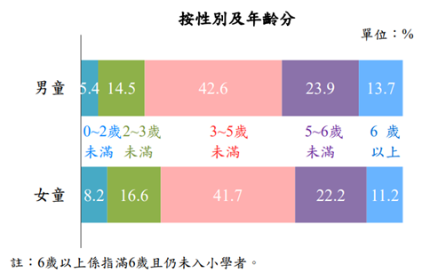
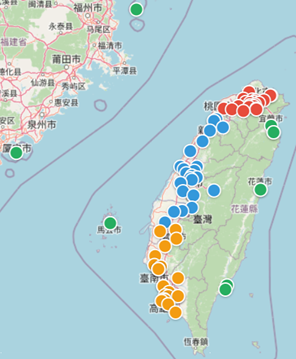
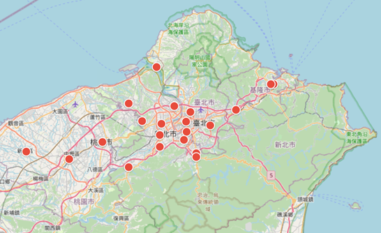
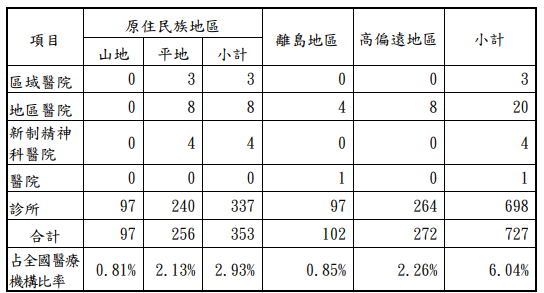
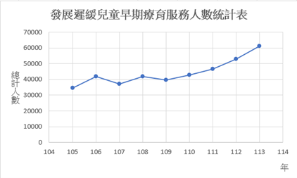
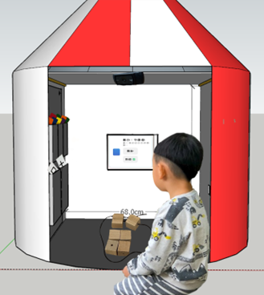
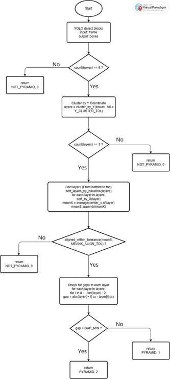
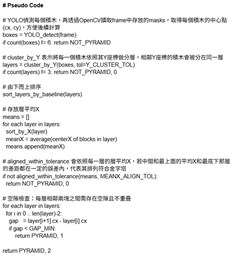
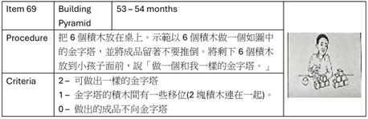

# 獵遲行動 - 兒童精細動作之 AI 檢測

## 專案概述

**專案名稱：** 獵遲行動-兒童精細動作之 AI 檢測  
**團隊名稱：** 獵遲小隊

### 系統特色

- 🎯 **標準化評估：** 基於 PDMS-2 專業量表
- 🎮 **遊戲化體驗：** 故事情境降低兒童測試抗拒
- 🚀 **AI 輔助判斷：** 自動化評分減輕人力負擔
- 📱 **可攜式設計：** 五分鐘快速架設，適合偏鄉巡迴
- ☁️ **雲端記錄：** 完整追蹤兒童發展歷程

---

## 目錄

1. [主題說明](#主題說明)
2. [作品特色](#作品特色)
3. [設計理念](#設計理念)
4. [架構說明](#架構說明)
5. [使用情境](#使用情境)
6. [商業模式](#商業模式)
7. [預期成果](#預期成果)
8. [安裝與使用指南](#安裝與使用指南)
9. [開發工具及相關說明](#開發工具及相關說明)
10. [參考資料](#參考資料)

## 主題說明

### 什麼是兒童發展遲緩？

根據 Guralnick[1] 的觀點，兒童發展遲緩通常源自於生物性風險，像先天性疾病或神經發展問題與環境性風險等多重因素，使得兒童在社交、動作或認知發展上落後於同齡。依據美國疾病管制與預防中心[2] 的說明，早期療育（Early Intervention, EI）是用來描述針對有發展遲緩或身心障礙的嬰幼兒及其家庭所提供的各類服務與支持，可能包括語言治療、物理治療，以及其他依孩子與家庭需求量身訂製的支持。由於幼兒發展具有高度可塑性，及早發現與介入能在黃金時期發揮最大療效，幫助兒童改善功能表現並促進家庭互動。

### 為什麼需要提早介入？

6 歲前是兒童發展的黃金時期。根據統計，110 年底早期療育個案中，以「3–5 歲未滿」者占比 42.3% 為最高，其次「5–6 歲未滿」占 23.4%，兩者合計達 66%。另外，「6 歲以上」者仍占 12.9%。若與性別交叉分析，男童「6 歲以上」占 13.7%，比女童的 11.2% 高出 2.4 個百分點；相對地，男童「0–3 歲未滿」占比 19.8%，比女童的 24.9% 低了 5 個百分點。這些數據顯示，多數孩子是在 3–6 歲才被發現問題，意味著很多兒童已經錯過了最早期的介入時機。

<div align="center">



**圖一、110 年底早期療育人數占比[3]**

</div>

兒童發展遲緩若能在黃金治療期及早發現並介入，能夠顯著提升康復與學習適應的機會。例如，Hennigan 等人[4]的研究顯示，在學齡前兒童中，經過八週由職能治療師主導的精細動作介入後，精細動作遲緩的比例從 85.7% 降至僅 7%，證明了早期療育對改善兒童發展的重要性。然而，偏鄉地區往往因醫療與教育資源不足，導致問題不易被及時發現。Barnard-Brak 等人[5]的研究顯示，來自偏鄉或少數族群的家庭更容易因醫療回應延遲，導致發展遲緩的診斷平均延後約 5 個月，增加了錯過早期療育黃金期的風險。同樣地，Hsieh 等人[6]針對台灣偏鄉的研究也指出，當地早期療育資源明顯不足，交通不便與人力缺乏使得兒童難以及時接受專業評估與介入。這些研究結果凸顯了在偏鄉地區建立一套低門檻、可攜式且易於操作的檢測系統的重要性，以協助第一線人員更早發現兒童的精細動作發展遲緩問題，避免延誤治療。

### 系統設計目的

此計畫希望設計一套簡單又方便攜帶的精細動作測驗工具，用來評估兒童是否有發育遲緩。本系統規劃放在偏鄉衛生所，透過巡迴的方式使用，讓偏鄉兒童也能接受測試，及早發現潛在問題，並進一步治療。偏鄉地區醫療與教育資源有限，老師和家長平時已相當忙碌，又沒有專業的職能治療師在身邊協助，因此往往難以及早察覺小朋友在手部精細動作上發展落後的狀況，很多時候，等到問題比較明顯才被注意到，往往已經錯過了最佳的黃金治療期。因此本系統轉譯專業工具為低門檻流程，於衛生所巡迴施測，讓老師與家長能更快、更早發現問題。
目前國際上最常被使用的兒童動作早期評量工具是皮巴迪動作發展量表第二版（Peabody Developmental Motor Scales 2nd edition，簡稱 PDMS-2）。這個量表適用於 0–7 歲兒童，施測方式標準化，可以把粗動作與精細動作分開評估，每個年齡層都有足夠的題目，結果也能以不同方式呈現，而且對障礙兒童也適用，是一個相當有影響力的工具。不過 PDMS-2 的限制在於需要專業的治療師來施測與判讀，對偏鄉老師或家長來說操作門檻太高，因此本系統把專業工具轉化成簡單、故事化的版本，讓偏鄉衛生所也可以進行施測。
整個過程對小朋友來說就像是在玩遊戲，會覺得自己是在幫助故事角色完成冒險，而不是接受測驗。對老師和家長而言，系統會將孩子完成任務的表現留下紀錄，方便更快、更清楚地判斷孩子是否在某些精細動作上需要關注或提早介入。目標是協助偏鄉的衛生所工作人員與家長，即使缺乏專業資源，也能及早察覺小朋友可能存在的發展遲緩問題，並在必要時儘快轉介到醫院或治療單位。透過這樣的方式，希望降低因環境限制而錯失早期介入機會的風險，讓孩子獲得更及時的協助。

### 為什麼選擇 PDMS-2 量表當標準？

根據 Relebo 等人(2021)[7] 針對 392 名 12 至 48 個月兒童進行驗證研究，結果顯示 PDMS-2 具有良好的內部一致性（α = 0.85）代表裡面的測驗項目和分數能夠清楚的反應出小朋友動作能力的好壞，而極高的重測信度（ICC = 0.98–0.99）表示同樣的小朋友在多次反覆測驗時，結果都相同，這兩項特點表示 PDMS-2 能穩定且有效區分小朋友對於粗大與精細動作的動作能力是否有發育遲緩的徵兆，適合作為臨床與教育上的動作發展評估工具。然其施測與判讀需專業治療師，偏鄉操作門檻高，故本系統以故事化與標準化導引，降低施測門檻並保留效度。

### 系統的重要性

根據衛福部[8] 的新聞報導，政府自 2024 年 7 月起針對未滿 7 歲兒童新增 6 次兒童發展篩檢服務，透過標準化工具進行檢測與評估，此政策顯示政府對於兒童發展的高度重視，也突顯此篩檢工具的實用價值與政策契合度，進一步證明本系統的應用可行性。

## 作品特色

如今影像辨識的技術已非常成熟，而藉由此技術配合模型辨識，讓整個系統做到無人自動化的辨識，結合妙妙屋環境，並具備下列優勢：

### 1. 標準化引導，無需專業背景

依介面指示與示範影片完成全流程，降低施測門檻
以往在操作 PDMS-2 量表的測量時，都需要有職能治療師在旁邊輔助，但職治師的人數有限，且不是每個衛生所都有職治師。而本系統，是以 PDMS-2 評估標準去設計，小朋友在使用時，流程設計參照 PDMS-2 規範，提供標準化引導，只需要按照介面的指示和示範影片一一操作，即可完成整個測驗流程。
2、 ### 2. 一袋帶走，五分鐘完成

帳簾、雙攝影機、觸控螢幕與摘疊場域，快速佈撤
除了解決職治師分配不均的問題，不是每一個衛生所，都有適合的環境給小朋友使用。本系統的環境包含妙妙屋帳篷、置物提袋、兩台攝影機、觸控螢幕以及ㄇ字形可折疊遊戲環境，提供給小朋友一個歡樂又舒適的環境，操作遊戲項目。架設和收拾只需不到五分鐘的時間就可以完成，只需要一個提袋即可攜帶全部的東西，改善了偏鄉地區復健教具搬移困難的問題。

### 3. 雲端留痕，持續追蹤

MySQL 紀錄單次與縱向表現，便於後續轉介與追蹤
早期療育的過程，往往需要多次的回診與復健，有個將每位小朋友的歷史活動記錄下來的系統，會讓整個治療過程變得非常順利。因此結合 MySQL 資料庫連動後端系統，可以將每位小朋友每次的活動各項評分和總分儲存，並於完成該次活動之後，回傳到資料庫，大大增加整個評估活動的便利性。

### 4. 故事化任務，降低抗拒

以情境任務隱藏測驗，提升參與與自然表現
在傳統看診時，很多孩童常常聽到自己要去看醫生，或一進到門診教室，就會大哭或是想要離開。本系統結合故事書的方法，將每個測試項目，串成一整個連貫的故事，小朋友在測試時，就宛如在幫故事書中的魔法師解決問題。當然，評估的結果也不會讓小朋友知道。

### 5. AI 輔助評分，減輕人力

即時偵測＋第二階段分類模型，貼近專業判斷
系統結合 AI 人工智慧技術去偵測物件，有需要時會再進入第二階段，利用機器學習模型分析，以往在測驗 PDMS-2 的時候，都需要職治師本人現場評分，但結合這個系統，可以減少職治師的負擔。且透過機器學習模型和物件影像偵測，可以模擬真人的判斷，只需要提供大量的樣本數據訓練，電腦也可以像真人一樣，看到測試圖就給出結果。

### 6. 模組化擴充

先支援 4–6 歲 12 項目，後續擴大年齡與題組
此系統目前預估支援 12 個 PDMS-2 項目，且適用年齡範圍在 4-6 歲，還可以再擴增適用範圍與測試項目數量；除了支援衛生所做巡迴使用，也可以引進到幼兒園，供幼稚園老師做使用，以便提早發現病狀，盡早接受治療。

## 設計理念

依據世界衛生組織 (WHO) 的統計，0 ～ 6 歲兒童發展遲緩的發生率大約是 7%。以台灣來說，每年大約有 20 萬個新生兒出生，換算下來，每年大約會有 1.4 萬名小朋友在六歲前可能出現某些發展遲緩的情況，包含認知、粗細動作、語言溝通、心理社會發展，甚至生活自理等各方面。這個數字其實不小，也顯示出「早期發現、早期協助」的重要性。
然而在現實中，偏鄉地區的醫療和教育資源有限，基層醫師難以全面追蹤，老師和家長也常缺乏專業判斷力，導致孩子往往要等到狀況已經很明顯時才被注意到，錯過了最佳的黃金治療期。根據衛服部健康署發布的評估中心名單，幾乎所有的評估中心都聚集在西半部(如圖二所示)，而東半部整塊區域卻只有四五家左右，評估中心都明顯集中於都市(如圖三所示)，都市與山區醫療資源分布高度集中，由這兩張圖可知偏鄉醫療資源的缺乏。

<div align="center">



**圖二、評估中心在台灣整體的分布圖[9]**

</div>

<div align="center">



**圖三、評估中心在台灣北部區域的分布圖[9]**

</div>
除了人力不足外，醫療機構的數量也嚴重不足。偏鄉及離島地區的醫療機構數量大約只占全國的 6% (如圖四所示)，分布密度相當低，有些鄉鎮甚至只能仰賴少數診所，甚至完全沒有醫療機構。這樣的情況，讓偏鄉兒童能夠獲得專業檢測與協助的機會大幅下降。

<div align="center">



**圖四、107 年度原住民族、離島及高偏遠地區各類醫療機構數統計[10]**

</div>
更值得注意的是，發展遲緩兒童的早期療育服務需求正逐年攀升。根據統計，台灣接受早期療育服務的兒童人數自 2016 年的 34,450 人次一路上升，到 2024 年已突破 61,000 人次（如圖五所示）。這顯示出發展遲緩並非小眾問題，而是需要社會資源積極回應的現實需求。對於偏鄉地區來說，如果沒有更多低門檻的檢測與篩查工具，將更難以及時發現與協助這些孩子。

<div align="center">



**圖五、發展遲緩兒童早期療育服務人數統計表[11]**

</div>
根據 Choo 等人[12]的研究，兒童發展遲緩的早期辨識通常仰賴例行性檢測或是透過父母、老師的觀察，然而，在偏鄉地區，醫療與教育資源不足，基層醫師難以全面進行監測，家長與老師也缺乏足夠的專業判斷。
在這樣的背景下，提出一套低門檻檢測工具，支援衛生所人員早期辨識並加速轉介，及早發現孩子在精細動作上的落後情況，並能更快轉介到醫院或治療單位。希望透過科技和教育的結合，來減少城鄉的差距。偏鄉老師很難隨時請到專業的職能治療師，但如果能把一些常見的檢測方法轉換成簡單的小工具，老師就能更早察覺孩子的問題，並即時提供幫助或轉介資源。
另外，本系統強調 「把測驗變成遊戲，把檢測變成故事」，提升投入、數據自然、降低測試效應。小朋友天生愛玩，醫療人員如果直接叫他們做一些手部測驗，小朋友可能會不耐煩或拒絕。但如果把測驗藏在故事裡，讓小朋友覺得自己是在冒險、在幫故事角色完成任務，就會玩得很投入。這樣一來，不僅整個過程變得輕鬆，小朋友也能在自然的狀態下完成動作，收集到的數據也會更準確，對老師和家長來說也更有參考價值。

## 架構說明

系統主要包含四個部分：

### 1. 實體妙妙屋

本系統的做法不是傳統那種冷冰冰的測驗，而是設計一個「妙妙屋」。妙妙屋(圖六)就類似一個小小的遊戲空間，前面放著一台平板，裡面會播放自己設計的故事情境。小朋友一旦走進妙妙屋，就好像進入了一個故事冒險的世界，不再是單純地被要求做測驗，而是透過故事角色與關卡的引導來完成任務。

<div align="center">



**圖六、妙妙屋建模**

</div>

### 2. 測驗道具與平台

這些道具，會高度還原 PDMS-2 量表所提供教具，比如圖形的大小、寬度、積木的尺寸大小等。測驗的平台會使用自架互動網站，嵌入到觸控螢幕讓小朋友作互動使用。

### 3. 分析系統

系統會透過小朋友的操作表現，根據 PDSM-2 分析是否符合同齡正常孩子的標準，評分的依據也會遵守 PDMS-2 的評估標準，在後端利用 AI 進行評估，以堆金字塔項目為範例，可見圖七、圖八、圖九。

<div align="center">



**圖七、堆金字塔程式流程圖**

</div>

<div align="center">



**圖八、堆金字塔程式流程圖 Pseudo Code**

</div>

<div align="center">



**圖九、PDMS-2 堆金字塔標準圖**

</div>

### 4. 回饋系統

把結果用簡單明瞭的方式呈現給老師或家長，可以依照著評分標準來決定小朋友是否需要近一步的評估或是治療，產出家長版與專業版報告範本（短版指標、長版歷程）。

## 使用情境

系統設計的初衷主要是希望小朋友能在一個輕鬆又有趣的環境下進行測驗，所以設計了「妙妙屋」這個小空間，裡面放著一台平板，平板會播放自製的故事，小朋友就像走進一個小冒險場景一樣，隨著故事的引導一步一步去完成任務。例如老師在課堂上可以安排孩子們輪流進入妙妙屋，小朋友進去後聽故事、跟著關卡冒險，做出畫線、疊積木、拿取小物件等等，而屋子旁邊掛著的實體工具會在故事的某些橋段被使用，孩子們就會自然地動手操作，這些動作同時也就是測驗的內容。
平板會把孩子的反應與表現完整記錄下來，不用有專門的老師且不用花太多心力就能讓大人們得到一份簡單的結果。除了教室，在課後輔導或是社區活動中心也可以讓小朋友參與這樣的活動。妙妙屋都能帶來一種遊戲化的學習與檢測體驗，讓小朋友覺得自己是在玩遊戲或幫助故事角色完成冒險，而大人則能藉此更快發現小朋友是否在精細動作上有需要關注的地方，達到「早期發現、早期協助」的目的。

## 商業模式

隨著少子化以及兒童發展關注度的提升，對早期療育的需求也日益增加。研究指出，兒童發展遲緩若能在黃金治療期及早發現並介入，能夠顯著提高康復機率。然而在偏鄉地區，醫療與教育資源不足，使得精細動作發展的檢查與追蹤較為困難，凸顯了簡單易用、可攜式檢測工具的市場需求。Hsieh 等人[6]亦指出透過「家庭訪視式早療方案」能有效改善偏鄉資源不足的困境，顯示推廣具體可行的檢測與輔助工具具有實際價值。
本系統參考 PDMS-2 的測驗標準，保留能反映兒童精細動作發展的重要指標，透過簡單直覺的操作流程與標準化設計，使小朋友能夠獨立完成整個測驗流程，結果回傳資料給醫療人員並儲存在資料庫，降低因資源不足導致漏測的機率，也能以數位化方式累積數據，方便後續的追蹤，進一步提升整體效率。
在實際應用上，本系統可作為「偏鄉早期篩檢輔助工具」透過地方政府或基金會的採購，在地方衛生所及學校進行使用，作為後續兒童發展追蹤的客觀依據，因此在偏鄉資源有限的情況下具備實際應用價值與推廣潛力。

## 預期成果

### 1. 老師面向

I. 減少依賴經驗判斷，透過「妙妙屋」故事情境中任務，快速獲得具客觀依據的孩童精細動作表現紀錄。
II. 不需專業職能治療背景即可操作，節省時間且提升判斷準確度。

### 2. 家長面向

I. 每項動作均有系統記錄，避免只用模糊「發展遲緩可能」警示，提高家長信任，促進及早就醫。
II. 降低家長焦慮，因數據佐證取代猜測。

### 3. 孩童體驗

I. 以故事化的遊戲化方式進行篩檢，減少測驗壓力，提升參與度與自然表現。
II. 小朋友在趣味任務中完成測驗內容，如「疊魔法石頭」、「用魔法畫筆完成線條」，表現更真實可靠。

### 4. 學校管理

I. 累積標準化量表指標與影音紀錄摘要，建立完整發展史。
II. 新任老師能無縫銜接孩子追蹤狀況，省去重新觀察時間。
III. 方便對照療育成效，支持專業人員掌握進度。

### 5. 長期影響

I. 減少偏鄉兒童發展遲緩案件數因延誤而惡化的情況。
I. 促使提早發現、提早轉介，增加孩童接受適時療育機會。
II. 幫助孩童將來課堂進度正常化，提升生活自理能力。
III. 減輕老師因缺乏專業資源的無力感，提供可依賴工具。
IV. 提升家長安心感，確保偏鄉兒童不因地理限制錯失協助。

## 安裝與使用指南

### 系統需求

#### 硬體需求

- **處理器：** Intel i5 或同等級以上
- **記憶體：** 8GB RAM 以上
- **儲存空間：** 10GB 可用空間
- **攝影機：** PW313D 雙鏡頭網路攝影機或相容裝置
- **顯示器：** 觸控螢幕 (建議 14 吋 IPS 1080P)

#### 軟體需求

- **作業系統：** Windows 11
- **Python 版本：** 3.7/3.10/3.13
- **資料庫：** MySQL 8.0+
- **瀏覽器：** Chrome/Edge (支援觸控功能)

### 快速開始

1. **環境準備**

   ```bash
   git clone https://github.com/WeiChengTW/Peabody-Developmental-Motor-Scales.git
   cd Peabody-Developmental-Motor-Scales
   pip install -r PDMS2_web/requirements.txt
   ```

2. **資料庫設置**

   - 安裝並啟動 MySQL
   - 執行資料庫初始化腳本

3. **啟動系統**

   ```bash
   cd PDMS2_web
   python run.py
   ```

4. **硬體架設**
   - 展開妙妙屋帳篷
   - 連接雙攝影機與觸控螢幕
   - 放置測驗道具於指定位置

## 開發工具及相關說明

### 核心技術框架

- **機器學習：** YOLOv8、YOLOv11 物件偵測模型
- **影像處理：** OpenCV、PIL
- **Web 框架：** Flask (Python 後端)
- **前端技術：** HTML5、CSS3、JavaScript (ES6+)
- **資料庫：** MySQL 關聯式資料庫

## 參考資料

[1] Guralnick, M. J. (2011). Why Early Intervention Works: A Systems Perspective. _Infants & Young Children_, 24(1), 6-28. Retrieved from https://journals.lww.com/iycjournal/fulltext/2011/01000/why_early_intervention_works__a_systems.2.aspx

[2] Centers for Disease Control and Prevention. (n.d.). Learn the signs. Act early: Early intervention. _U.S. Department of Health & Human Services_. Retrieved from https://www.cdc.gov/act-early/early-intervention/index.html

[3] 行政院主計總處綜合統計處. (2022). 國情統計通報：110 年發展遲緩兒童早期療育服務人數 1.9 萬人. Retrieved from https://ws.dgbas.gov.tw/001/Upload/463/relfile/11150/89262/110%E5%B9%B4%E7%99%BC%E5%B1%95%E9%81%B2%E7%B7%A9%E5%85%92%E7%AB%A5%E6%97%A9%E6%9C%9F%E7%99%82%E8%82%B2%E6%9C%8D%E5%8B%99%E4%BA%BA%E6%95%B81.9%E8%90%AC%E4%BA%BA.pdf

[4] Hennigan, A., Ladd, K., & Wolfe, A. (2021). The effects of occupational therapy–led fine motor centers on preschoolers' fine motor skills. _Journal of Occupational Therapy, Schools, & Early Intervention_, 14(3), 234-250. Retrieved from https://eric.ed.gov/?id=EJ1322481

[5] Barnard-Brak, L., Morales-Aleman, M. M., Tomeny, K., & McWilliam, R. A. (2021). Rural and Racial/Ethnic Differences in Children Receiving Early Intervention Services. _Family & Community Health_, 44(1), 52-58. doi: 10.1097/FCH.0000000000000285

[6] Hsieh, Y. H., et al. (2020). Collaborative Home-Visit Program for Young Children With Motor Delays in Rural Taiwan: A Pilot Randomized Controlled Trial. _Physical Therapy_, 100(6), 979-994. doi: 10.1093/ptj/pzaa033

[7] Rebelo, M., Serrano, J., Duarte-Mendes, P., Paulo, R., Marinho, D. A., & Martins, J. (2021). Validity and reliability of the Portuguese version of the Peabody Developmental Motor Scales-II in children aged 12 to 48 months. _Journal of Motor Learning and Development_, 9(2), 264-275. Retrieved from https://pmc.ncbi.nlm.nih.gov/articles/PMC8623394/

[8] 衛生福利部. (2024). 7 月 1 日起正式上路 未滿 7 歲兒童新增 6 次「兒童發展篩檢服務」透過接受標準化篩檢工具找出關鍵原因. Retrieved from https://www.mohw.gov.tw/cp-16-79140-1.html

[9] 衛生福利部國民健康署. (n.d.). 衛生福利部國民健康署補助地方推動兒童發展聯合評估中心名單. Retrieved from https://www.hpa.gov.tw/Pages/Detail.aspx?nodeid=1602&pid=548

[10] 衛生福利部. (n.d.). 我國偏鄉離島地區醫療資源及相關提升計畫執行成效之探討. Retrieved from https://share.google/yaiUBYD6cQvq4Cahq

[11] 衛生福利部. (2024). 優化偏鄉醫療精進計畫第二期. Retrieved from https://share.google/2wvYmhQ713gsbjvCE

[12] Choo, Y. Y., Agarwal, P., How, C. H., & Yeleswarapu, S. P. (2019). Developmental delay: identification and management at primary care level. _Singapore Medical Journal_, 60(3), 119-123. doi: 10.11622/smedj.2019025
[2] C. f. D. C. a. Prevention. "Learn the signs. Act early: Early intervention. ." U.S. Department of Health & Human Services. https://www.cdc.gov/act-early/early-intervention/index.html (accessed.
[3] 行. 綜合統計處. "國情統計通報." https://ws.dgbas.gov.tw/001/Upload/463/relfile/11150/89262/110%E5%B9%B4%E7%99%BC%E5%B1%95%E9%81%B2%E7%B7%A9%E5%85%92%E7%AB%A5%E6%97%A9%E6%9C%9F%E7%99%82%E8%82%B2%E6%9C%8D%E5%8B%99%E4%BA%BA%E6%95%B81.9%E8%90%AC%E4%BA%BA.pdf (accessed.
[4] A. Hennigan, Ladd, K., & Wolfe, A. , "The effects of occupational therapy–led fine motor centers on preschoolers’ fine motor skills. Journal of Occupational Therapy, Schools, & Early Intervention,," 2021. [Online]. Available: https://eric.ed.gov/?id=EJ1322481.
[5] L. Barnard-Brak, M. M. Morales-Aleman, K. Tomeny, and R. A. McWilliam, "Rural and Racial/Ethnic Differences in Children Receiving Early Intervention Services," Fam Community Health, vol. 44, no. 1, pp. 52–58, Jan/Mar 2021, doi: 10.1097/FCH.0000000000000285.
[6] Y. H. Hsieh et al., "Collaborative Home-Visit Program for Young Children With Motor Delays in Rural Taiwan: A Pilot Randomized Controlled Trial," Phys Ther, vol. 100, no. 6, pp. 979–994, Jun 23 2020, doi: 10.1093/ptj/pzaa033.
[7] M. Rebelo, Serrano, J., Duarte-Mendes, P., Paulo, R., Marinho, D. A., & Martins, J., "Validity and reliability of the Portuguese version of the Peabody Developmental Motor Scales-II in children aged 12 to 48 months.," 2021. [Online]. Available: https://pmc.ncbi.nlm.nih.gov/articles/PMC8623394/
https://ws.dgbas.gov.tw/001/Upload/463/relfile/11150/89262/110%E5%B9%B4%E7%99%BC%E5%B1%95%E9%81%B2%E7%B7%A9%E5%85%92%E7%AB%A5%E6%97%A9%E6%9C%9F%E7%99%82%E8%82%B2%E6%9C%8D%E5%8B%99%E4%BA%BA%E6%95%B81.9%E8%90%AC%E4%BA%BA.pdf.
[8] "7 月 1 日起正式上路 未滿 7 歲兒童新增 6 次「兒童發展篩檢服務」透過接受標準化篩檢工具找出關鍵原因. 衛生福利部最新消息." https://www.mohw.gov.tw/cp-16-79140-1.html (accessed.
[9] 衛生福利部婦幼健康組. "衛生福利部國民健康署補助地方推動 兒童發展聯合評估中心名單." https://www.hpa.gov.tw/Pages/Detail.aspx?nodeid=1602&pid=548 (accessed.
[10] 衛生福利部, "我國偏鄉離島地區醫療資源及相關提升計畫執行成效之探討 ", (n.d.). [Online]. Available: https://share.google/yaiUBYD6cQvq4Cahq
[11] 衛生福利部, "優化偏鄉醫療精進計畫第二期," 2024. [Online]. Available: https://share.google/2wvYmhQ713gsbjvCE
[12] Y. Y. Choo, P. Agarwal, C. H. How, and S. P. Yeleswarapu, "Developmental delay: identification and management at primary care level," Singapore Med J, vol. 60, no. 3, pp. 119–123, Mar 2019, doi: 10.11622/smedj.2019025.
